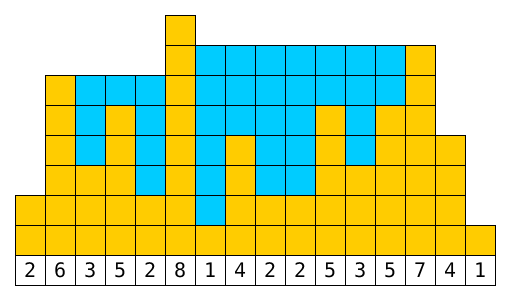

The goal of this challenge is to write a program to solve a numeric problem. In addition to *just* solving the problem we are going to compare the runtime of the submissions with growing inputs.

The Problem
-----------

Given a sequence (array) of positive integers. Each integer represents a bar with the height of that integer. All the bars next to each other make a shape (like a bar diagram). Imagine water is poured on top of this shape. What is the volume of water the shape can hold?



As illustrated in the image, the solution for the input `[2,6,3,5,2,8,1,4,2,2,5,3,5,7,4,1]` would be 35.

The Specifics
-------------

The program will be given 2 command line arguments, a filename and an amount. The file contains a comma separated list of numbers between 0 and 1000. The amount is the amount of numbers in the given file. The amount will be a power of 2 (4, 8, 16, 32, ...) (this may help people who try a divide-and-conquer approach). The program is expected to write 2 lines to the console: the solution and the number of milliseconds it took to calculate.

For the previous example there could be a file named "example.txt" with the content:

```
2,6,3,5,2,8,1,4,2,2,5,3,5,7,4,1
```

The execution of a Python submission named "submission.py" would look like:

    $ python submission.py example.txt 16
    35
    42.22

(if the calculation took 42.22 milliseconds)

We want the time measurement to be included in the program to avoid measuring startup time and file IO (so more languages can be competitive!). The submission is supposed to read the given file into a simple container (array, vector, list), start the time measurement, calculate the solution based on the container, stop the time measurement, and print the result. We will check the source code to ensure time measurement is done in an acceptable way.

Submissions will be compared on a virtual machine running Ubuntu x64 16.04 (Xenial Xerus) with 4GB ram and 4x3400 MHz CPU. So your submission needs to be able to run on Linux (note: even C# runs on Linux these days).

We will increase the size of the input data until a reasonable execution time is reached!

Have Fun
--------

  * Beginners: Don't be afraid of the performance competition. A successful and correct submission is a huge feat!
  * Advanced Users: Don't be too focused on the language choice. Also consider multi threading!


Deadline: 18th September midnight of your local time zone. (2 weeks)
